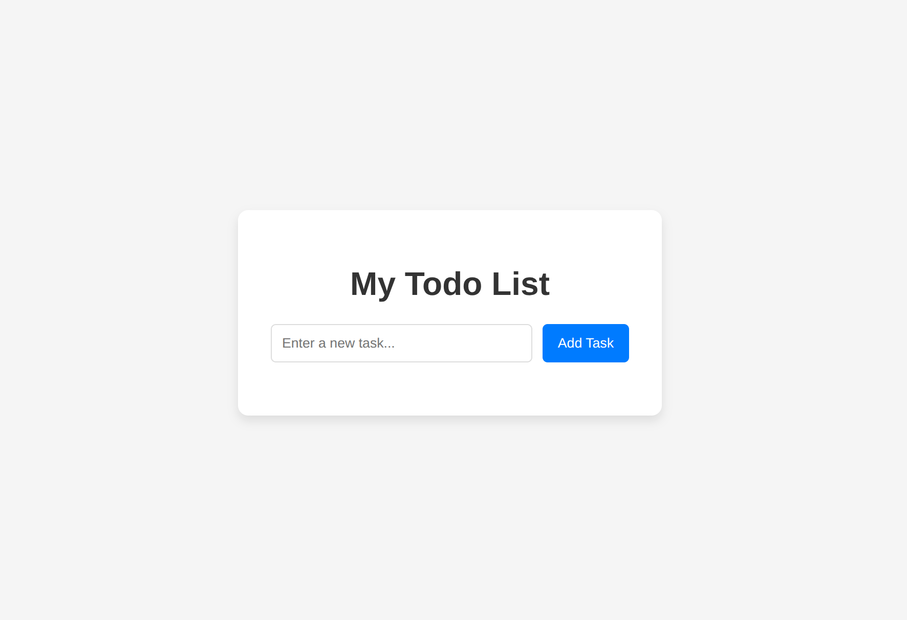
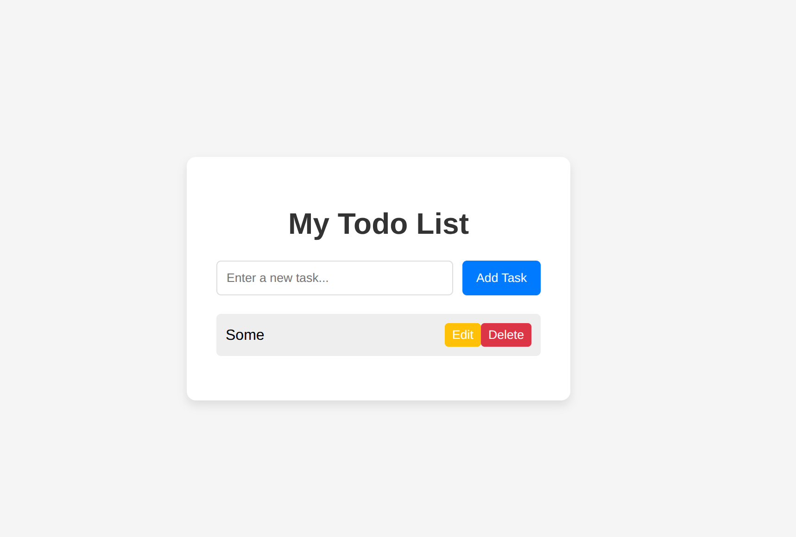

# 📝 Simple Todo List App

This is a simple **Todo List** web application built using **HTML**, **CSS**, and **JavaScript**.

--


## 🚀 Features

- Add new tasks  
- Edit existing tasks  

- Delete tasks  

- Clean and responsive design  

---

## 🧰 Technologies Used
- HTML  
- CSS  
- JavaScript (Vanilla JS)

---

## 🖥️ How to Run
1. Clone the repository:
   ```bash
   git clone https://github.com/<your-username>/todo-list-app.git
